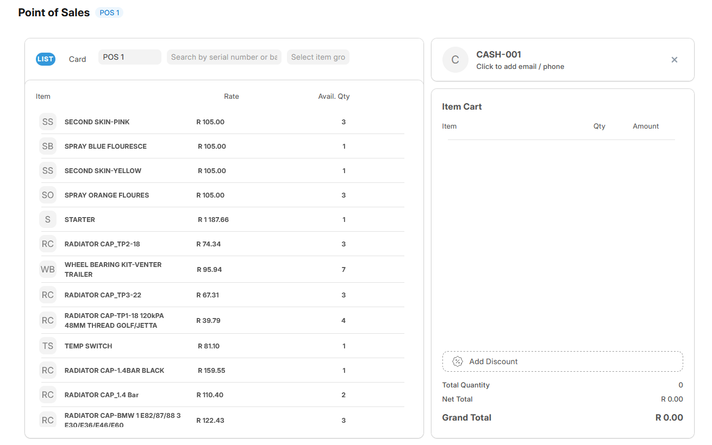

<div align="center" markdown="1">


# POSNext

**POSNext for ERPNext**

</div>


### POSNext


POSNext is an **open-source Point of Sale (POS) system** designed specifically for ERPNext. This repo is a fork of POSNext, which is a fork of the default ERPNext POS, enriched with additional features inspired by **POSAwesome** and further innovations to meet the demands of modern retail and business environments. POSNext serves as a **flexible, customizable alternative** to POSAwesome, offering users improved adaptability and enhanced functionalities.


### License

MIT


### Features

- Full Compatibility with ERPNext POS Features
- Profile Lock in POS Settings
- Show Order List Button
- Show Held Button
- Mobile Number-Based Customer Identification
- Show Checkout Button
- Show Only List View
- Show Only Card View
- Show Open Form View
- Show Toggle for Recent Orders
- Save as Draft Option
- Close POS Option
- Default View Setting (Card/List)
- Allow Adding New Items on Separate Lines
- Display Posting Date
- Show OEM Part Number
- Show Logical Rack Location
- Edit Rate and UOM (Unit of Measure)
- Enable Credit Sales
- Add Additional Notes
- Include and Exclude Tax Options
- Display Alternative Items for POS Search
- Configure Mobile Number Length
- Send Invoice via WhatsApp
- Customizable POS Profile
- Credit Sale
- Incoming Rate

### User documentation

📄 POSNext: https://[yoursite].com/posnext

### Installation

You can install this app using the [bench](https://github.com/frappe/bench) CLI:

```bash
cd $PATH_TO_YOUR_BENCH
bench get-app $URL_OF_THIS_REPO --branch develop
bench install-app posnext
```

### Development

#### Tests

To run unit tests:

```shell
bench --site test_site run-tests --app posnext --coverage
```

To run UI/integration tests:

The following depencies are required
```shell
sudo apt update
# Dependencies for cypress: https://docs.cypress.io/guides/continuous-integration/introduction#UbuntuDebian
sudo apt-get install libgtk2.0-0 libgtk-3-0 libgbm-dev libnotify-dev libgconf-2-4 libnss3 libxss1 libasound2 libxtst6 xauth xvfb

sudo apt-get install chromium
```

```shell
bench --site test_site run-ui-tests posnext --headless --browser chromium
```

#### Contributing

This app uses `pre-commit` for code formatting and linting. Please [install pre-commit](https://pre-commit.com/#installation) and enable it for this repository:

```bash
cd apps/posnext
pre-commit install

#(optional) Run against all the files
pre-commit run --all-files
```

Pre-commit is configured to use the following tools for checking and formatting your code:

- ruff
- eslint
- prettier
- pyupgrade


We use [Semgrep](https://semgrep.dev/docs/getting-started/) rules specific to [Frappe Framework](https://github.com/frappe/frappe)
```shell
# Install semgrep
python3 -m pip install semgrep

# Clone the rules repository
git clone --depth 1 https://github.com/frappe/semgrep-rules.git frappe-semgrep-rules

# Run semgrep specifying rules folder as config 
semgrep --config=/workspace/development/frappe-semgrep-rules/rules apps/posnext
```

#### Updating Documentation

For documentation, we use [vitepress](https://vitepress.dev/). You can run `yarn docs:dev` to preview the docs when applying changes

#### CI

This app can use GitHub Actions for CI. The following workflows are configured:

- CI: Installs this app and runs unit tests on every push to `develop` branch.
- Linters: Runs [Frappe Semgrep Rules](https://github.com/frappe/semgrep-rules) and [pip-audit](https://pypi.org/project/pip-audit/) on every pull request, as well as [Semgrep](https://semgrep.dev/docs/getting-started/)

